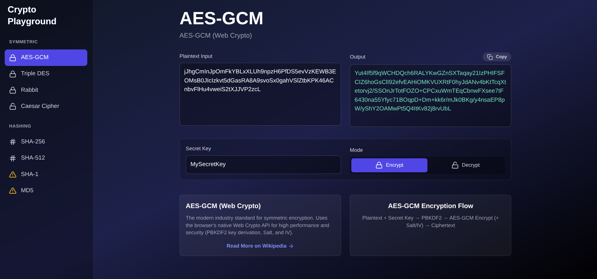

# Cryptography Playground

This is a web-based interactive application for exploring various cryptographic algorithms. It provides a user-friendly interface to encrypt, decrypt, and hash text using a selection of classic and modern ciphers and hash functions. This project is built with React and Vite.




## Features

  * **Interactive UI:** A simple and intuitive interface for experimenting with different cryptographic methods.
  * **Symmetric Encryption:**
      * **AES-GCM:** Modern industry-standard encryption.
      * **Triple DES:** An older, now deprecated, block cipher.
      * **Rabbit:** A high-performance stream cipher.
      * **Caesar Cipher:** A classic substitution cipher for educational purposes.
  * **Hashing Algorithms:**
      * **SHA-256 & SHA-512:** Industry-standard cryptographic hash functions.
      * **SHA-1 & MD5:** Insecure and broken hash functions, included for educational purposes to demonstrate vulnerabilities.
  * **Algorithm Information:** Each algorithm includes a description and a link to its Wikipedia page for further reading.

## Tech Stack

  * **Frontend:** React, Vite
  * **Styling:** Tailwind CSS
  * **Cryptography:** crypto-js, Web Crypto API

## Getting Started

### Prerequisites

  * Node.js and npm (or yarn)

### Installation & Running the App

1.  Clone the repository:
    ```bash
    git clone https://github.com/your-username/cryptography-playground.git
    ```
2.  Navigate to the project directory:
    ```bash
    cd cryptography-playground
    ```
3.  Install dependencies:
    ```bash
    npm install
    ```
4.  Start the development server:
    ```bash
    npm start
    ```
    The application will be available at `http://localhost:3000`.

## Available Scripts

  * `npm start`: Runs the app in development mode.
  * `npm run build`: Builds the app for production.
  * `npm test`: Launches the test runner.
